<h1 align="center">Hi, I'm Yash 👋</h1>

  

I build mobile apps for a living, mostly with Flutter. Right now I'm at **Temflo Systems**, working on enterprise apps: screens people actually use every day, REST APIs behind them, and the boring-but-important job of making things load faster.

I like code that a teammate can read six months later without swearing at me.

## What I'm working on

- Shipping cross-platform Flutter apps at work
- Getting better at backend and system design (I want to own the whole thing, not just the UI)
- Poking at AI/ML and DevOps on the side

## What I use

  
  
  
  
  
  
  
  
  

## Stuff I've built

<!-- Replace these with your real repos. Two honest lines each beats a long pitch. -->
- **[project-name](https://github.com/yash02k3/project-name)**: what it does and why you made it.
- **[project-name](https://github.com/yash02k3/project-name)**: what it does and one thing you learned.

## Stats

  
  

## Say hi

[LinkedIn](https://www.linkedin.com/in/yash02k3) · [Email](mailto:you@example.com)

Always learning. Usually with the terminal open.
